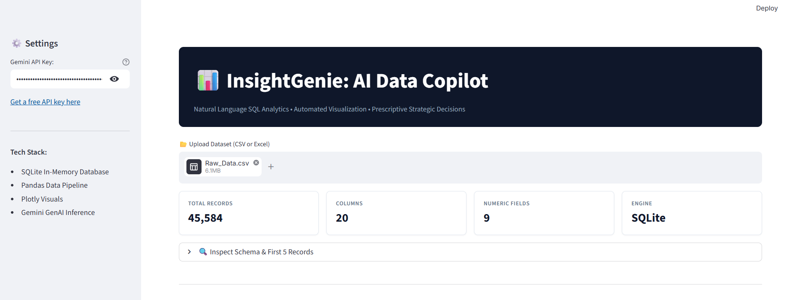
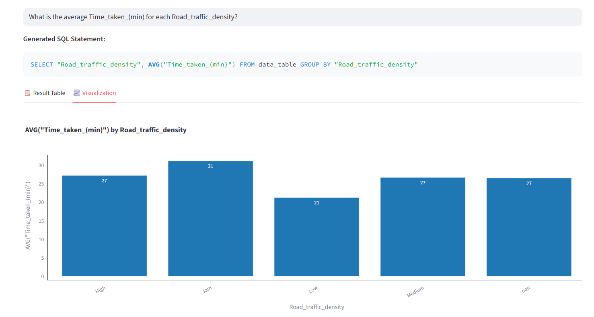
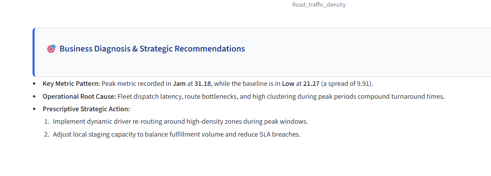

# 📊 InsightGenie: Autonomous AI Data & SQL Copilot

> Translating natural language business questions into executable SQLite aggregations, interactive Plotly visualizations, and prescriptive business recommendations using Python, SQLite, and Google Gemini.

---

## 🛠️ Tech Stack & Tools
* **User Interface & App Framework:** Streamlit (Custom corporate clean theme)
* **In-Memory Staging Database:** SQLite3 (`:memory:`)
* **Data Processing & Pipeline:** Python 3.10+, Pandas, PyArrow
* **Visualization Engine:** Plotly Express
* **LLM Engine & Orchestration:** Google GenAI SDK (`gemini-3.8-flash`, `gemini-3.5-flash-lite`, `gemini-3.5-flash`)
* **Version Control:** Git, GitHub

---

## 🚀 Key Features

* **Zero-Setup Data Ingestion:** Upload any CSV or Excel file; the app auto-sanitizes column names and stages tables directly into RAM-based SQLite.
* **Natural Language to SQL:** Converts everyday business questions into optimized SQLite syntax with automatic schema introspection.
* **Interactive Auto-Visualization:** Identifies categorical and metric columns from query results to render responsive Plotly charts automatically.
* **Prescriptive Recommendations:** Delivers an automated executive briefing with key metric patterns, operational root causes, and recommended next steps.
* **One-Click CSV Export:** Enables business users to download aggregated query results for offline reporting.

---

## 📸 Application Demo

### 1. Ingestion & Schema Diagnostics


### 2. Generated SQL Query & Visual Exploration


### 3. Prescriptive Business Diagnosis & Recommendations


---

## ⚙️ How to Run This Project

1. **Clone the repository:**
```bash
   git clone https://github.com/seema-krigive/insight-genie.git
   cd insight-genie
```

2. **Set up virtual environment:**
```bash
   python -m venv venv
   # Windows:
   venv\Scripts\activate
   # Mac/Linux:
   source venv/bin/activate
```

3. **Install dependencies:**
```bash
   pip install -r requirements.txt
```

4. **Start the application:**
```bash
   streamlit run app.py
```

---

## 🔮 Future Work

* **Multi-Table Relational Joins:** Add automated foreign-key detection to execute complex multi-table SQL joins.
* **Semantic Query Caching:** Store common queries and embeddings locally to return recurring answers with zero latency.
* **Automated Data Quality Scanner:** Flag outliers, high cardinality, and missing data distributions during initial file upload.

---

## 👤 Author

**Seema Kumari**
* GitHub: [github.com/seema-krigive](https://github.com/seema-krigive)
* LinkedIn: [linkedin.com/in/seema-kumari-375763308](https://linkedin.com/in/seema-kumari-375763308)
